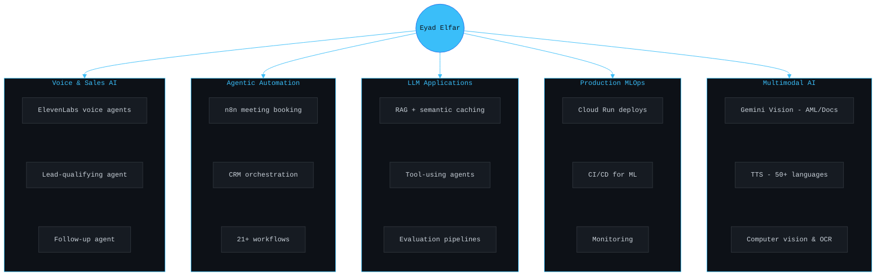

```mermaid
%%{init: {'theme':'base','flowchart':{'wrappingWidth':300},'themeVariables':{'fontFamily':'monospace','lineColor':'#3ABEF9'}}}%%
flowchart LR
    E["<b>2023 · e-finance</b><br/><b>Data Analyst</b><br/>Analyzed 500M+ transactional records, surfacing 10+ behavioral insights in digital payments. Built an automated reporting pipeline and optimized ETL to double throughput with no latency increase."]:::c0
    I["<b>2023-24 · iSchool</b><br/><b>AI Instructor</b><br/>Mentored 70+ students across 64 sessions and guided 36 AI-driven game projects using reinforcement learning. Hands-on Python, Scratch, Arduino, and PictoBlox."]:::c1
    M["<b>2024-25 · MENRV.AI</b><br/><b>Data Scientist</b><br/>Launched a vLLM merchandising suite (Shein, Myntra) with virtual try-on at 90% fit and a content generator (-80% time). Built an AI deck assistant, a BiLSTM + Prophet forecaster (8h to 5min), and TTS across 50+ languages."]:::c2
    N["<b>2024-25 · NEOMI</b><br/><b>AI Engineer (Contract)</b><br/>Built the core AI engine for an AR learning platform serving 15,000+ students, with handwriting recognition and an LLM evaluator at 92% alignment. Added CI/CD (debugging -75%) and scaled to 20 German schools."]:::c3
    B["<b>2025-Now · Baron & Cabot</b><br/><b>AI Engineer</b><br/>Architected a FastAPI/React copilot over WebSockets using Vertex AI, RAG, and semantic caching for sub-500ms guidance. Built ElevenLabs voice agents on n8n that auto-book meetings, a Cloud Run platform automating 30+ CRM stages with Gemini Vision, and a 14-factor ML lead-scoring model."]:::c4

    E --> I --> M --> N --> B

    classDef c0 fill:#0E2A38,stroke:#3ABEF9,color:#E6EDF3,text-align:left;
    classDef c1 fill:#102844,stroke:#2D8FE0,color:#E6EDF3,text-align:left;
    classDef c2 fill:#0E2150,stroke:#1F6FEB,color:#E6EDF3,text-align:left;
    classDef c3 fill:#231047,stroke:#6E40C9,color:#E6EDF3,text-align:left;
    classDef c4 fill:#062E27,stroke:#0E7C66,color:#E6EDF3,text-align:left;
```
 

 

---

##  About Me

<table width="100%">
<tr>
<td width="65%" valign="top">

Hi, I’m **Eyad Elfar**, an **AI Engineer in Dubai, UAE** building production **LLM, voice, and agentic systems** for **real estate and fintech**. I architect real-time copilots, voice agents, and automation that run inside live business workflows — not just demos.

My focus is AI that is **fast, reliable, measurable, and useful**: sub-second guidance, agents that take real actions, and pipelines that move the numbers leadership actually tracks.

### What I build

- **LLM applications** with RAG, tools, memory, and semantic caching
- **Voice AI agents** (ElevenLabs) for lead qualification, follow-ups, and automated meeting booking
- **Multi-agent & n8n automation** across the CRM lifecycle, reporting, and scheduling
- **Multimodal pipelines** with Gemini Vision, computer vision, OCR, and multilingual TTS
- **Data products** connecting analytics, ML scoring, and measurable business impact

</td>
<td width="35%" align="center" valign="top">

</td>
</tr>
</table>

---

##  Impact Snapshot

<table align="center">
<tr>
<td align="center" width="175"><h3>sub-500ms</h3><b>Real-time AI Guidance</b></td>
<td align="center" width="175"><h3>30+</h3><b>CRM Stages Automated</b></td>
<td align="center" width="175"><h3>21+</h3><b>n8n Workflows Deployed</b></td>
<td align="center" width="175"><h3>14-Factor</h3><b>ML Lead Scoring</b></td>
</tr>
<tr>
<td align="center" width="175"><h3>500M+</h3><b>Records Analyzed</b></td>
<td align="center" width="175"><h3>15K+</h3><b>Students Served</b></td>
<td align="center" width="175"><h3>50+</h3><b>Languages Supported</b></td>
<td align="center" width="175"><h3>Bronze</h3><b>Kaggle Notebook Medal</b></td>
</tr>
</table>

---

##  Professional Journey

---

##  Featured Projects

<table width="100%">
<tr>
<td width="50%" valign="top">

###  Gamers’ Mental Health Classifier
**NLP · Explainable AI · Kaggle Notebook**

Built an NLP pipeline to classify mental-health-related risk signals in gaming community discussions.

**Impact**

- **94%** classification accuracy
- Earned a **Kaggle Bronze Notebook Medal**
- **5,000+** Reddit posts processed
- SHAP explanations for transparent model decisions

**Stack**

</td>
<td width="50%" valign="top">

###  Cigarette Butt Detection System
**Computer Vision · Real-time Detection · Environmental AI**

Developed a YOLOv8-based object detection system for identifying cigarette-butt litter in public-space imagery.

**Impact**

- **92%** detection accuracy
- Real-time detection with dashboard integration
- Up to **70%** reduction in manual monitoring effort
- Designed for public-space monitoring workflows

**Stack**

</td>
</tr>
<tr>
<td width="50%" valign="top">

###  English Character OCR Engine
**OCR · Deep Learning · Deployment-ready Recognition**

Created a custom OCR pipeline for English character recognition on scanned or low-quality documents.

**Impact**

- **96%** character recognition accuracy
- Robust preprocessing for noisy document quality
- Packaged for API-based deployment
- Designed for production-style testing and iteration

**Stack**

</td>
<td width="50%" valign="top">

###  One-Shot Attendance System
**Graduation Thesis · Face Recognition · Real-time Dashboarding**

Built a real-time attendance system that captures attendance from a single image using face detection and recognition.

**Impact**

- One-shot attendance capture without manual roll call
- Combined YOLO, RetinaFace, and MTCNN
- Integrated records with MySQL and MS SSIS
- Built live reporting dashboards with Power BI

**Stack**

</td>
</tr>
</table>

---

##  Technical Arsenal

### AI / ML Specializations

<b>Core engineering stack</b>

 

**Languages & APIs**

**AI / ML Frameworks**

**Agents, Voice & Automation**

**Cloud, Data & MLOps**

---

##  Education & Certifications

<table width="100%">
<tr>
<td width="50%" valign="top">

### BSc in Computer Science & Artificial Intelligence
**Helwan University** · Egypt  
*2020 – 2024*

**Grade:** Excellent with Honors

**Graduation project:** One-Shot Attendance System using advanced face detection and recognition.

</td>
<td width="50%" valign="top">

### Certifications

- McKinsey Forward Program — McKinsey & Company, 2024
- NLP Specialization — Coursera, 2024
- Secure Intelligence Training — Ericsson, 2023
- Data Science Diploma — Orange Digital Center, 2023
- Machine Learning Nanodegree — Udacity & EGFWD, 2023

</td>
</tr>
</table>

---

##  Currently Building & Exploring

---

<b> GitHub Activity</b>

 

<picture>
  <source media="(prefers-color-scheme: dark)" srcset="https://github-readme-streak-stats-eight.vercel.app/?user=eyadelfar&theme=tokyonight&hide_border=true&date_format=M%20j%5B%2C%20Y%5D&ring=3ABEF9&fire=FF6B6B&currStreakLabel=3ABEF9" />
  <source media="(prefers-color-scheme: light)" srcset="https://github-readme-streak-stats-eight.vercel.app/?user=eyadelfar&theme=default&hide_border=true&date_format=M%20j%5B%2C%20Y%5D&ring=3ABEF9&fire=FF6B6B&currStreakLabel=0D1117" />
  
</picture>

  

<picture>
  <source media="(prefers-color-scheme: dark)" srcset="https://github-readme-activity-graph.vercel.app/graph?username=eyadelfar&theme=tokyo-night&hide_border=true&area=true&custom_title=Contribution%20Graph" />
  <source media="(prefers-color-scheme: light)" srcset="https://github-readme-activity-graph.vercel.app/graph?username=eyadelfar&theme=github-compact&hide_border=true&area=true&custom_title=Contribution%20Graph" />
  
</picture>

  

<picture>
  <source media="(prefers-color-scheme: dark)" srcset="https://github-profile-trophy-tawny.vercel.app/?username=eyadelfar&theme=tokyonight&no-frame=true&no-bg=false&margin-w=4&column=7" />
  <source media="(prefers-color-scheme: light)" srcset="https://github-profile-trophy-tawny.vercel.app/?username=eyadelfar&theme=flat&no-frame=true&no-bg=true&margin-w=4&column=7" />
  
</picture>

---

##  Let’s Collaborate

I’m open to collaboration around **LLM systems, voice agents, RAG, AI automation, data products, computer vision, and production ML workflows**.

 

 

